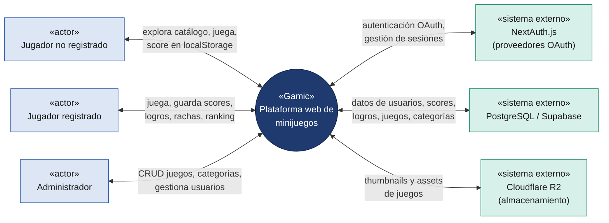
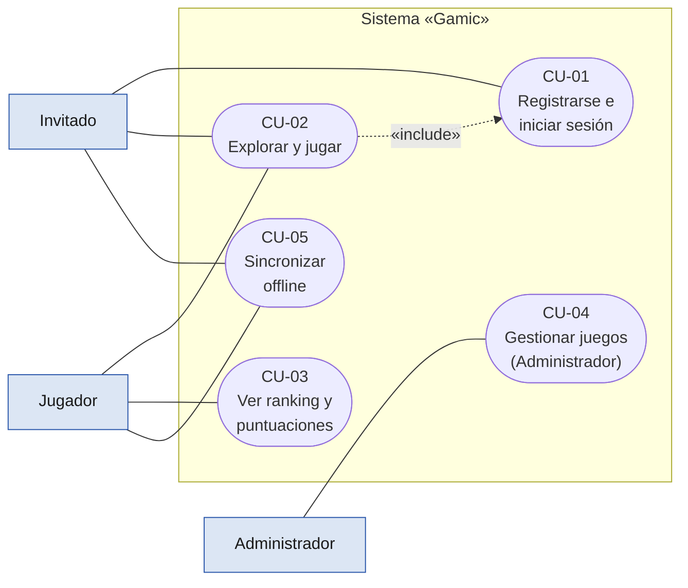
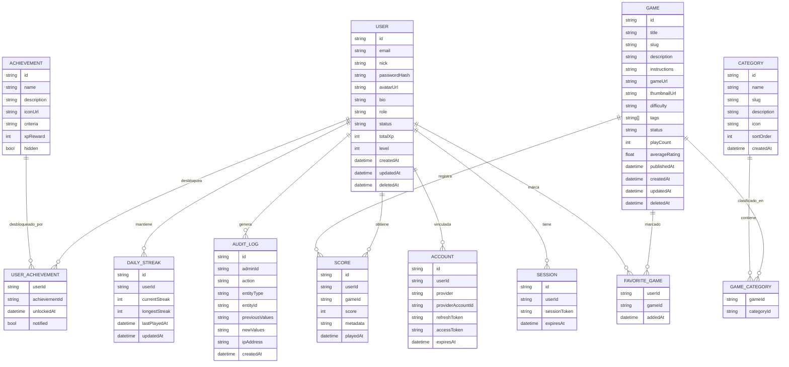
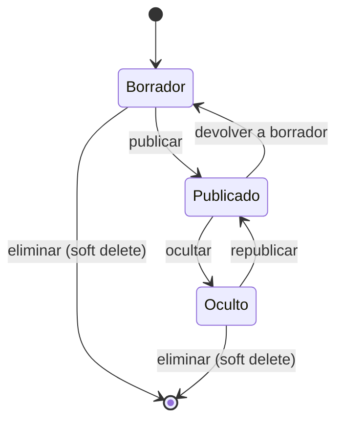
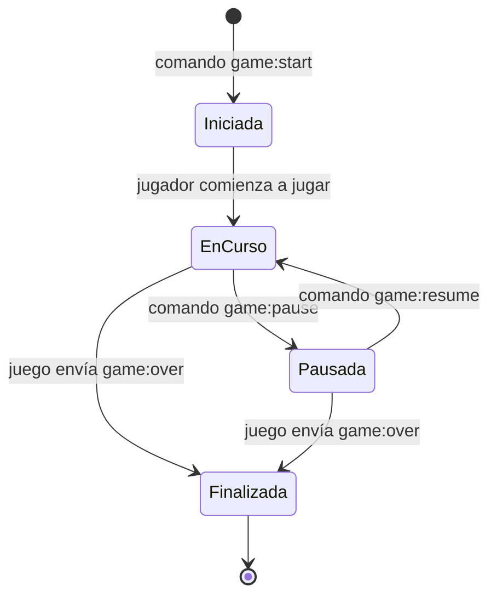
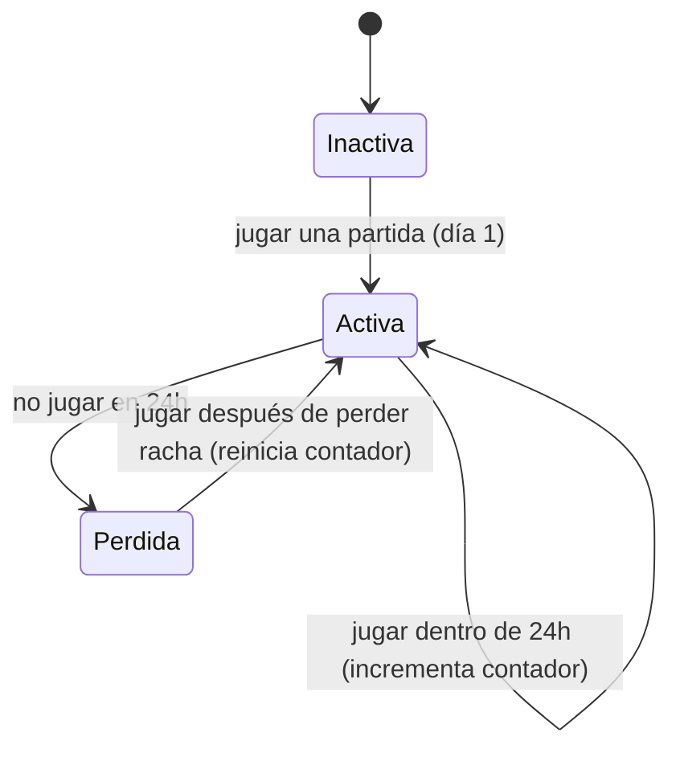

# Especificación de Requisitos de Software (ERS)

## Plataforma de minijuegos «Gamic Games Platform»

> Elaborado conforme al estándar IEEE 830-1998

| Campo | Detalle |
| --- | --- |
| **Documento** | Especificación de Requisitos de Software |
| **Versión** | 1.0 |
| **Fecha** | 4 de julio de 2026 |
| **Empresa** | Nothing Sense (En formación) |
| **Autor** | Steven Ricardo Quiñones (CTO) |
| **Revisor** | Fredinson Solano (CEO) |
| **Ciudad** | Montería, Córdoba, Colombia |
| **Carácter** | Uso interno |

---

## Historial de revisiones

| Versión | Fecha | Descripción | Autor |
| --- | --- | --- | --- |
| 0.9 | 02/07/2026 | Borrador con introducción, descripción general y requisitos funcionales/no funcionales. | Steven R. Quiñones |
| 1.0 | 04/07/2026 | Primera versión completa: se incorporan reglas de negocio, criterios de aceptación, casos de uso detallados, modelo conceptual de datos, diagramas de estado y matrices de trazabilidad. | Steven R. Quiñones |

---

## Tabla de contenido

- [1. Introducción](#1-introducción)
  - [1.1 Propósito](#11-propósito)
  - [1.2 Alcance del producto](#12-alcance-del-producto)
  - [1.3 Definiciones, acrónimos y abreviaturas](#13-definiciones-acrónimos-y-abreviaturas)
  - [1.4 Referencias](#14-referencias)
  - [1.5 Visión general del documento](#15-visión-general-del-documento)
- [2. Descripción general](#2-descripción-general)
  - [2.1 Perspectiva del producto](#21-perspectiva-del-producto)
  - [2.2 Funciones del producto](#22-funciones-del-producto)
  - [2.3 Características de los usuarios](#23-características-de-los-usuarios)
  - [2.4 Restricciones](#24-restricciones)
  - [2.5 Suposiciones y dependencias](#25-suposiciones-y-dependencias)
  - [2.6 Evolución previsible del sistema](#26-evolución-previsible-del-sistema)
- [3. Requisitos específicos](#3-requisitos-específicos)
  - [3.1 Requisitos de interfaces externas](#31-requisitos-de-interfaces-externas)
  - [3.2 Requisitos funcionales](#32-requisitos-funcionales)
  - [3.3 Requisitos no funcionales](#33-requisitos-no-funcionales)
  - [3.4 Reglas de negocio](#34-reglas-de-negocio)
  - [3.5 Criterios de aceptación](#35-criterios-de-aceptación)
- [4. Modelos de análisis](#4-modelos-de-análisis)
  - [4.1 Diagrama de casos de uso](#41-diagrama-de-casos-de-uso)
  - [4.2 Casos de uso detallados](#42-casos-de-uso-detallados)
  - [4.3 Modelo conceptual de datos](#43-modelo-conceptual-de-datos)
  - [4.4 Diagramas de estados](#44-diagramas-de-estados)
- [5. Matrices de trazabilidad](#5-matrices-de-trazabilidad)
  - [5.1 Trazabilidad casos de uso ↔ requisitos funcionales](#51-trazabilidad-casos-de-uso--requisitos-funcionales)
  - [5.2 Trazabilidad requisitos funcionales ↔ no funcionales](#52-trazabilidad-requisitos-funcionales--no-funcionales)
  - [5.3 Trazabilidad requisitos funcionales ↔ reglas de negocio](#53-trazabilidad-requisitos-funcionales--reglas-de-negocio)
  - [5.4 Trazabilidad objetivos ↔ requisitos](#54-trazabilidad-objetivos--requisitos)
- [6. Apéndices](#6-apéndices)
  - [6.1 Apéndice A. Actores del sistema](#61-apéndice-a-actores-del-sistema)
  - [6.2 Apéndice B. Glosario extendido y notas finales](#62-apéndice-b-glosario-extendido-y-notas-finales)
  - [6.3 Apéndice C. Aprobación del documento](#63-apéndice-c-aprobación-del-documento)

---

## 1. Introducción

### 1.1 Propósito

El presente documento tiene como propósito definir, de manera detallada y estructurada, los requisitos funcionales y no funcionales de la plataforma de minijuegos «Gamic Games Platform». Sirve como referencia común entre los interesados —usuarios, equipo de desarrollo, equipo de pruebas y partes académicas— para comprender el alcance del sistema, sus funciones y sus restricciones.

Asimismo, constituye la base para las fases de diseño, implementación, verificación y validación del software. El documento se ha elaborado siguiendo las recomendaciones del estándar IEEE 830-1998 para la especificación de requisitos de software.

### 1.2 Alcance del producto

El producto de software se denomina «Gamic Games Platform». Es una plataforma web de minijuegos —similar en concepto a Friv.com— que alberga juegos originales desarrollados internamente con Canvas 2D y TypeScript. La plataforma ofrece un catálogo navegable de juegos, ejecución de partidas con comunicación bidireccional vía GameBridge (postMessage sobre iframes sandbox), sistema de puntuaciones globales y locales, rankings por juego y combinado, logros desbloqueables, rachas diarias con bonificación, perfiles de jugador con progreso y nivel, y un panel de administración para la gestión completa del catálogo y los usuarios.

La plataforma se construye con Next.js App Router (monolito modular con Server Components y Client Components), base de datos PostgreSQL con Prisma ORM, almacenamiento de objetos Cloudflare R2 para thumbnails y assets de juegos, y autenticación mediante NextAuth.js. Los juegos se empaquetan y despliegan como activos estáticos que se cargan en iframes con sandbox estricto, comunicándose con la plataforma padre a través del protocolo GameBridge basado en postMessage.

El sistema se empaqueta para su distribución móvil mediante Capacitor, permitiendo su instalación como aplicación nativa en Android e iOS manteniendo el mismo código base.

Quedan explícitamente fuera del alcance de esta versión:
- Multijugador en tiempo real (sincrónico o asíncrono).
- Suscripciones, planes de pago o micropagos.
- Mercado de juegos de terceros o sistema de subida de juegos por usuarios externos.
- Chat en vivo, foros o redes sociales internas.
- Motor de físicas o juegos 3D (todos los juegos usan Canvas 2D).
- Integración con plataformas de streaming o captura de partidas.

### 1.3 Definiciones, acrónimos y abreviaturas

La siguiente tabla recoge los términos y acrónimos empleados a lo largo del documento.

| Término / Acrónimo | Definición |
| --- | --- |
| **ERS** | Especificación de Requisitos de Software. |
| **IEEE** | Institute of Electrical and Electronics Engineers, entidad que publica el estándar 830. |
| **RF** | Requisito funcional: una función o comportamiento que el sistema debe ofrecer. |
| **RNF** | Requisito no funcional: una cualidad o restricción del sistema (rendimiento, seguridad, etc.). |
| **RN** | Regla de negocio: política, restricción o cálculo del dominio que el sistema debe respetar. |
| **CU** | Caso de uso: descripción de una interacción entre un actor y el sistema para lograr un objetivo. |
| **GameBridge** | Protocolo de comunicación bidireccional basado en postMessage entre la plataforma principal y los juegos ejecutados en iframes sandbox. Define eventos estandarizados como `score`, `gameover`, `start`, `pause`, `resume`, `restart`, `error`. |
| **MVP** | Minimum Viable Product: producto mínimo viable con las funcionalidades esenciales para su lanzamiento. |
| **Canvas API** | API de HTML5 que permite el renderizado de gráficos 2D programáticos mediante JavaScript, utilizada como motor base de todos los juegos de Gamic. |
| **ADR** | Architecture Decision Record: registro de decisiones de arquitectura. |
| **RBAC** | Role-Based Access Control: control de acceso basado en roles. |
| **GameEngine** | Capa de abstracción interna sobre Canvas API que unifica el bucle de juego, el sistema de entradas, la detección de colisiones básica y la gestión de escenas en todos los juegos de la plataforma. |
| **iframe sandbox** | Mecanismo de seguridad HTML que restringe las capacidades de un iframe (ejecución de scripts, envío de formularios, acceso al padre) mediante atributos específicos. |
| **postMessage** | API de HTML5 que permite la comunicación segura entre ventanas y iframes de distintos orígenes, utilizada como base del protocolo GameBridge. |
| **JWT** | JSON Web Token: estándar para la transmisión segura de información entre partes como un objeto JSON firmado. |
| **OAuth** | Protocolo de autorización que permite el acceso delegado a recursos en nombre del usuario, utilizado para autenticación con proveedores externos (Google, GitHub). |
| **Capacitor** | Framework de código abierto que permite empaquetar aplicaciones web como aplicaciones nativas para iOS, Android y la Web. |
| **OTP** | One-Time Password: contraseña de un solo uso para verificación en dos pasos. |
| **SLA** | Service Level Agreement: acuerdo de nivel de servicio. |
| **Hash** | Resumen criptográfico que permite verificar la integridad de un dato o documento. |

### 1.4 Referencias

- IEEE Std 830-1998, IEEE Recommended Practice for Software Requirements Specifications.
- ISO/IEC 25010, Modelo de calidad del producto de software.
- OWASP Foundation, OWASP Top 10 — 2021.
- Next.js Documentation, Vercel Inc., https://nextjs.org/docs.
- Capacitor Documentation, Ionic Framework, https://capacitorjs.com/docs.
- Prisma ORM Documentation, Prisma Data Inc., https://www.prisma.io/docs.
- MDN Web Docs — Canvas API, Mozilla, https://developer.mozilla.org/en-US/docs/Web/API/Canvas_API.
- MDN Web Docs — postMessage, Mozilla, https://developer.mozilla.org/en-US/docs/Web/API/Window/postMessage.
- MDN Web Docs — iframe sandbox, Mozilla, https://developer.mozilla.org/en-US/docs/Web/HTML/Element/iframe#attr-sandbox.
- OMG, Unified Modeling Language (UML) Specification, versión 2.5.1.

### 1.5 Visión general del documento

El documento se organiza en seis secciones principales. La sección 1 (Introducción) presenta el propósito, el alcance, las definiciones y las referencias. La sección 2 (Descripción general) describe la perspectiva del producto, sus funciones, los tipos de usuario, las restricciones y las suposiciones. La sección 3 (Requisitos específicos) detalla las interfaces externas, los requisitos funcionales organizados por módulos, los requisitos no funcionales, las reglas de negocio y los criterios de aceptación. La sección 4 (Modelos de análisis) incorpora el diagrama y las descripciones de los casos de uso, el modelo conceptual de datos y los diagramas de estados. La sección 5 (Matrices de trazabilidad) relaciona casos de uso, requisitos, reglas de negocio y objetivos. Finalmente, la sección 6 (Apéndices) incluye los actores, un glosario extendido y la aprobación del documento.

---

## 2. Descripción general

### 2.1 Perspectiva del producto

«Gamic Games Platform» es un producto nuevo e independiente, no derivado de un sistema preexistente. Se apoya en servicios externos para autenticación (NextAuth.js con proveedores OAuth), almacenamiento de objetos (Cloudflare R2) y base de datos (PostgreSQL con Prisma ORM).

Los usuarios interactúan con el sistema a través de un navegador web (desktop o mobile) o mediante la aplicación empaquetada con Capacitor en dispositivos móviles. La plataforma se estructura como un monolito modular con Next.js App Router, donde cada módulo funcional (autenticación, catálogo, juego, puntuaciones, logros, administración) ocupa un paquete o grupo de rutas bien definido.

La arquitectura de ejecución de juegos es un aspecto central del producto. Cada juego es un activo HTML/CSS/JS independiente que se renderiza dentro de un iframe con atributo `sandbox` estricto. La comunicación entre la plataforma principal y el juego se realiza exclusivamente mediante el protocolo GameBridge, basado en la API postMessage de HTML5. Este aislamiento garantiza que los juegos no puedan acceder al DOM de la plataforma, a las cookies de sesión ni al almacenamiento local del contexto padre, cumpliendo con los principios de seguridad de OWASP.

Los juegos se desarrollan internamente utilizando Canvas 2D con TypeScript. Cada juego comparte una capa base común denominada GameEngine, que abstrae el bucle de juego, el sistema de entrada (teclado, ratón, táctil) y la gestión de escenas.

El siguiente diagrama de contexto distingue tres elementos: el **sistema en estudio** («Gamic Games Platform»), los **actores** (personas o roles que usan la plataforma) y los **sistemas externos** con los que se integra. Cada flecha representa el intercambio bidireccional de datos.

*Figura 1. Diagrama de contexto de «Gamic Games Platform» y sus integraciones externas.*

### 2.2 Funciones del producto

De forma resumida, el sistema ofrecerá las siguientes funciones principales:

- Catálogo de juegos con tarjetas, thumbnails, categorías y búsqueda.
- Ejecución de juegos en Canvas 2D dentro de iframes aislados con comunicación GameBridge.
- Sistema de puntuaciones: registro de puntuaciones globales para usuarios autenticados y locales para usuarios no registrados.
- Rankings: ranking global por juego (top 10 con paginación) y ranking combinado (suma de puntuaciones de todos los juegos).
- Logros desbloqueables con notificación visual y sonora.
- Rachas diarias con bonificación en puntos y cálculo de racha activa/perdida.
- Perfiles de jugador con historial de partidas, logros desbloqueados y nivel de experiencia.
- Panel de administración con CRUD completo de juegos y categorías, gestión de usuarios y panel de estadísticas.
- Autenticación con email+password y proveedores OAuth (Google, GitHub).
- Empaquetado móvil mediante Capacitor con soporte táctil, orientación landscape y notificaciones push.

### 2.3 Características de los usuarios

La plataforma está dirigida a distintos perfiles de usuario, con diferentes niveles de interacción y permisos.

| Tipo de usuario | Descripción | Nivel técnico |
| --- | --- | --- |
| **Jugador no registrado (invitado)** | Usuario que explora el catálogo y juega partidas sin crear una cuenta. Sus puntuaciones se guardan exclusivamente en localStorage. No accede a logros, rachas ni rankings globales. | Básico |
| **Jugador registrado** | Usuario que ha creado una cuenta (email+password u OAuth). Guarda puntuaciones globales, acumula logros, mantiene rachas diarias, aparece en rankings y tiene un perfil personalizado con nivel y progreso. | Básico |
| **Administrador** | Personal de la plataforma encargado de gestionar el catálogo de juegos, las categorías y los usuarios. Tiene acceso al panel de administración con CRUD completo y logs de auditoría. | Avanzado |

### 2.4 Restricciones

- El sistema debe cumplir la legislación colombiana sobre protección de datos personales (Ley 1581 de 2012) y comercio electrónico (Ley 527 de 1999).
- La solución debe ser una aplicación web responsiva con diseño mobile-first, sin requerir la instalación de software adicional por parte del usuario, más allá del navegador.
- El sistema debe cumplir con las guías de seguridad de OWASP Top 10 para mitigar las vulnerabilidades web más comunes.
- Todos los juegos deben ejecutarse en Canvas 2D sin utilizar motores externos (Unity, Unreal, Phaser). Se permite una capa interna GameEngine compartida, pero no dependencias de terceros para el renderizado.
- Los juegos deben ejecutarse en iframes con el atributo `sandbox` configurado de forma restrictiva, sin acceso al DOM padre, a cookies ni a localStorage del contexto superior.
- La interfaz debe ofrecerse, como mínimo, en idioma español.
- Los datos sensibles (contraseñas, tokens) deben protegerse mediante cifrado en tránsito (TLS 1.3) y en reposo.
- El tamaño de cada bundle de juego no debe exceder los 500 KB en compresión gzip.

### 2.5 Suposiciones y dependencias

- Se asume que los usuarios disponen de un dispositivo con navegador moderno compatible con Canvas 2D y postMessage.
- Se asume que los usuarios disponen de conexión a internet para las funcionalidades online (puntuaciones globales, ranking, logros, autenticación). Las funcionalidades offline (juegos cacheados, puntuaciones locales) tienen soporte parcial.
- Se asume la disponibilidad de los servicios externos: Supabase (PostgreSQL gestionado), Cloudflare R2 (almacenamiento de objetos) y los proveedores OAuth (Google, GitHub).
- El correcto funcionamiento de NextAuth.js depende de la configuración de los proveedores OAuth y del secreto JWT.
- Se asume que los juegos desarrollados internamente implementan correctamente el protocolo GameBridge para la comunicación con la plataforma.

### 2.6 Evolución previsible del sistema

Se prevén las siguientes líneas de evolución posteriores a esta versión:

- **Multijugador asíncrono:** Tablas de puntuaciones semanales con enfrentamientos indirectos entre jugadores.
- **Multijugador en tiempo real:** Partidas simultáneas usando WebRTC o WebSockets para juegos seleccionados.
- **Marketplace de juegos de terceros:** Sistema de revisión y publicación de juegos creados por la comunidad.
- **Sistema de logros con recompensas visuales:** Insignias animadas, temas de perfil y efectos especiales en el canvas.
- **Integración con plataformas de streaming:** Compartir partidas en Twitch o YouTube directamente desde la plataforma.
- **Aplicación móvil nativa:** Migración gradual de Capacitor a Kotlin/Swift para prestaciones específicas de plataforma.

---

## 3. Requisitos específicos

### 3.1 Requisitos de interfaces externas

#### 3.1.1 Interfaces de usuario

El sistema proporcionará una interfaz web responsiva con diseño mobile-first, en español, accesible desde navegadores de escritorio y móviles. La interfaz debe ser intuitiva, coherente y orientada a la acción, minimizando la fricción para que el usuario pueda empezar a jugar lo antes posible.

A continuación se relaciona el inventario de pantallas principales previsto para la primera versión. Sirve de guía para el diseño de interfaz y para la planificación de pruebas de usabilidad.

| Código | Pantalla | Descripción | Actores |
| --- | --- | --- | --- |
| **IU-01** | Home / Landing | Página principal con hero/banner destacado, categorías en pills, secciones de juegos (destacados, nuevos, populares) y footer. | Todos |
| **IU-02** | Registro / Inicio de sesión | Formulario de registro con email+password u OAuth (Google, GitHub), inicio de sesión y recuperación de contraseña. | Invitado |
| **IU-03** | Catálogo / Explorar | Grid de juegos con filtros por categoría, ordenamiento, búsqueda con autocompletado y paginación. | Todos |
| **IU-04** | Detalle de juego | Página individual del juego con área de juego (iframe), toolbar, sidebar con puntuaciones y ranking, descripción, controles y juegos relacionados. | Todos |
| **IU-05** | Juego / Canvas | Área de juego en iframe con GameBridge activo, overlay de inicio, toolbar de control y pantalla de resultados. | Todos |
| **IU-06** | Perfil de jugador | Perfil con avatar, nick, nivel, barra de XP, estadísticas, historial de partidas, logros desbloqueados y juegos favoritos. | Jugador registrado |
| **IU-07** | Rankings | Ranking global por juego (top 10 con paginación) y ranking combinado con puntuación total acumulada. | Todos |
| **IU-08** | Logros | Grid de logros con icono, nombre, descripción, estado (bloqueado/desbloqueado) y progreso. | Jugador registrado |
| **IU-09** | Admin: Juegos | Panel CRUD de juegos con tabla, formulario de alta/edición, subida de thumbnail y control de estado (borrador, publicado, oculto). | Administrador |
| **IU-10** | Admin: Categorías | Panel CRUD de categorías con nombre, slug, ícono y orden de visualización. | Administrador |
| **IU-11** | Admin: Usuarios | Listado de usuarios con acciones de suspensión, cambio de rol y visualización de detalles. | Administrador |
| **IU-12** | Admin: Estadísticas | Panel con gráficos y métricas: juegos más jugados, usuarios activos, puntuaciones totales, distribución por categoría. | Administrador |

#### 3.1.2 Interfaces de hardware

El sistema no requiere hardware especializado por parte del usuario. Del lado del cliente basta con un dispositivo con navegador moderno compatible con HTML5 Canvas 2D, postMessage y capacidades táctiles (para la experiencia móvil óptima). Las características adicionales como acelerómetro o giroscopio no son requisito para esta versión.

Del lado del servidor, la plataforma se desplegará sobre infraestructura de nube con capacidad acorde a la carga prevista (Vercel para frontend/API, Supabase para base de datos).

Para las notificaciones push en dispositivos móviles (empaquetado Capacitor), se requiere que el dispositivo soporte el servicio de push notifications del sistema operativo correspondiente.

#### 3.1.3 Interfaces de software

El sistema se integrará con los siguientes servicios externos a través de sus interfaces de programación (API):

- **NextAuth.js:** Biblioteca de autenticación que se integra con proveedores OAuth (Google, GitHub) y con el adaptador de base de datos Prisma para persistencia de sesiones y cuentas.
- **Supabase (PostgreSQL gestionado):** Base de datos relacional accedida mediante Prisma ORM. No se utiliza ninguna otra funcionalidad de Supabase (Auth, Storage, Realtime).
- **Cloudflare R2:** Almacenamiento de objetos compatible con S3 para thumbnails de juegos y assets estáticos. Se accede mediante el cliente S3 estándar desde el backend de Next.js.
- **Capacitor Plugins:** Para la versión empaquetada móvil, se integran los plugins oficiales de Capacitor: `@capacitor/haptics` (retroalimentación háptica en eventos del juego), `@capacitor/status-bar` (control de la barra de estado en modo landscape) y `@capacitor/screen-orientation` (bloqueo de orientación landscape durante el juego).

#### 3.1.4 Interfaces de comunicación

La comunicación entre el cliente y el servidor se realizará sobre el protocolo HTTPS con TLS 1.3. Las integraciones con servicios externos emplearán protocolos seguros y mecanismos de autenticación adecuados.

La comunicación entre la plataforma principal y los juegos en iframe se realiza exclusivamente a través de la API postMessage de HTML5, encapsulada en el protocolo GameBridge. Los mensajes se validan mediante el origen (`origin`) y, cuando es necesario, mediante un token de sesión firmado incluido en el mensaje.

### 3.2 Requisitos funcionales

Los requisitos funcionales se organizan por módulos funcionales, dado que la plataforma Gamic presenta agrupaciones naturales de funcionalidad (autenticación y usuarios, juegos, puntuaciones, categorías y navegación, administración y móvil) con límites bien definidos entre sí. Este enfoque facilita la asignación de responsabilidades al equipo de desarrollo, la trazabilidad con los componentes de diseño y la planificación incremental de las pruebas. Cada requisito se identifica con un código único (RF-XXX), un nombre, una descripción y una prioridad relativa (Alta, Media o Baja).

#### 3.2.1 Módulo Autenticación y Usuarios

Agrupa las funcionalidades que permiten a los jugadores acceder a la plataforma, gestionar su identidad y mantener sesiones persistentes y seguras.

| ID | Requisito | Prioridad |
| --- | --- | --- |
| **RF-001** | **Registro con email y contraseña.** El sistema debe permitir que un nuevo usuario se registre proporcionando una dirección de correo electrónico válida, un nombre de usuario (nick) único y una contraseña segura (mínimo 8 caracteres, al menos una mayúscula, un número y un carácter especial). | Alta |
| **RF-002** | **Registro con OAuth (Google, GitHub).** El sistema debe permitir el registro y el inicio de sesión mediante proveedores de identidad externos Google y GitHub. La primera vez que un usuario se autentica con OAuth, se crea automáticamente su cuenta enlazando el perfil del proveedor. | Alta |
| **RF-003** | **Inicio de sesión.** El sistema debe permitir a los usuarios autenticarse mediante correo electrónico y contraseña o mediante proveedores OAuth. Tras cinco intentos fallidos consecutivos, la cuenta se bloquea temporalmente por 15 minutos. | Alta |
| **RF-004** | **Recuperación de contraseña.** El sistema debe permitir restablecer la contraseña a través de un enlace seguro enviado al correo registrado, con una ventana de validez de 30 minutos. | Media |
| **RF-005** | **Perfil de usuario editable.** El sistema debe permitir al usuario registrado editar su perfil: nick, avatar (subida de imagen o selección de avatar predeterminado) y biografía (máximo 280 caracteres). | Media |
| **RF-006** | **Roles de usuario con RBAC.** El sistema debe administrar dos roles: Jugador (acceso a catálogo, juegos, perfiles, rankings, logros) y Administrador (acceso adicional al panel de administración). El control de acceso se aplica en API routes y componentes del lado del servidor. | Alta |
| **RF-007** | **Cierre de sesión.** El sistema debe permitir al usuario cerrar su sesión, invalidando el JWT y limpiando las cookies de sesión. | Alta |
| **RF-008** | **Suspensión de cuenta por administrador.** El sistema debe permitir al administrador suspender temporalmente una cuenta. Un usuario suspendido no puede iniciar sesión ni jugar, y sus puntuaciones no aparecen en los rankings. La suspensión incluye un motivo visible para el usuario al intentar acceder. | Media |
| **RF-009** | **Sesión persistente con JWT y refresh token.** El sistema debe mantener la sesión del usuario mediante JWT (access token con validez de 1 hora) y refresh token (validez de 7 días almacenado en cookie httpOnly). El refresh token se renueva silenciosamente en cada petición API. | Alta |
| **RF-010** | **Eliminación de cuenta por el usuario.** El sistema debe permitir al usuario solicitar la eliminación de su cuenta y todos sus datos asociados. La eliminación se ejecuta tras un período de gracia de 7 días durante el cual el usuario puede cancelar la solicitud. | Baja |

#### 3.2.2 Módulo Juegos

Constituye el núcleo de la plataforma: la publicación, ejecución y gestión del ciclo de vida de los juegos.

| ID | Requisito | Prioridad |
| --- | --- | --- |
| **RF-011** | **Catálogo con tarjetas.** El sistema debe mostrar el catálogo de juegos como una cuadrícula de tarjetas (GameCards). Cada tarjeta muestra: título del juego, categoría, thumbnail (imagen 16:9), calificación promedio y un botón "Jugar rápido". Las tarjetas deben cargar los thumbnails con lazy loading mediante Intersection Observer. | Alta |
| **RF-012** | **Carga de juego en iframe con GameBridge.** El sistema debe cargar cada juego en un elemento iframe con atributo `sandbox` configurado con los permisos mínimos necesarios (`allow-scripts`, `allow-same-origin`). El iframe debe establecer el protocolo GameBridge inmediatamente después de la carga. | Alta |
| **RF-013** | **Ejecución, pausa y finalización.** El sistema debe permitir al usuario iniciar, pausar/reanudar y reiniciar el juego mediante comandos enviados a través de GameBridge. El juego debe informar de su estado actual (iniciado, en curso, pausado, finalizado) mediante eventos GameBridge. | Alta |
| **RF-014** | **Reporte de puntuación desde el juego.** El juego debe reportar la puntuación obtenida al finalizar la partida mediante el evento `score` del protocolo GameBridge. La plataforma recibe la puntuación y, si el usuario está autenticado, la registra en la base de datos como puntuación global. | Alta |
| **RF-015** | **Almacenamiento de partidas incompletas (offline).** El sistema debe guardar el estado de la partida en localStorage cuando el usuario está jugando y pierde conexión o cierra el navegador. Al reabrir el juego, debe ofrecer la opción de reanudar desde el último checkpoint guardado. | Baja |
| **RF-016** | **Protocolo GameBridge para eventos.** El sistema debe implementar el protocolo GameBridge basado en postMessage para recibir los siguientes eventos desde el juego: `game:loaded` (juego cargado y listo), `game:started` (jugador inició la partida), `game:score` (reporte de puntuación con valor numérico), `game:over` (partida finalizada con puntuación final), `game:error` (error interno del juego con código y mensaje), `game:checkpoint` (punto de guardado con datos de progreso). | Alta |
| **RF-017** | **Protocolo GameBridge para comandos.** El sistema debe implementar el protocolo GameBridge para enviar los siguientes comandos al juego: `game:start` (iniciar o reiniciar la partida), `game:pause` (pausar la partida), `game:resume` (reanudar la partida), `game:restart` (reiniciar desde cero), `game:getState` (solicitar estado actual con datos de progreso y puntuación). | Alta |
| **RF-018** | **Token de sesión en GameBridge.** Cada mensaje enviado desde la plataforma al juego debe incluir un token de sesión firmado (JWT breve con expiración de 5 minutos) que el juego puede verificar para confirmar que la comunicación proviene de la plataforma legítima. | Alta |

#### 3.2.3 Módulo Puntuaciones, Logros y Rachas

Gestiona el sistema de puntuaciones, el desbloqueo de logros y el seguimiento de rachas diarias como elementos de gamificación y retención.

| ID | Requisito | Prioridad |
| --- | --- | --- |
| **RF-019** | **Registro de puntuación global.** El sistema debe registrar la puntuación reportada por el juego en la base de datos cuando el usuario está autenticado. Cada registro incluye: id de usuario, id de juego, puntuación (numérica), timestamp y metadatos opcionales (nivel alcanzado, tiempo de partida). | Alta |
| **RF-020** | **Ranking global por juego.** El sistema debe mostrar el ranking top 10 de puntuaciones para cada juego, utilizando la mejor puntuación de cada usuario. El ranking debe incluir paginación para ver más allá del top 10. El usuario actual debe resaltarse si aparece en el ranking. | Alta |
| **RF-021** | **Ranking global combinado.** El sistema debe calcular y mostrar un ranking combinado que sume las mejores puntuaciones del usuario en todos los juegos disponibles. Este ranking fomenta la exploración del catálogo completo. | Media |
| **RF-022** | **Historial de partidas del usuario.** El sistema debe mostrar al usuario autenticado el historial de sus partidas recientes (últimas 50), incluyendo juego, puntuación, fecha y duración. | Media |
| **RF-023** | **Logros desbloqueables.** El sistema debe gestionar un conjunto de logros predefinidos. Cada logro tiene: id, nombre, descripción, icono, criterio de desbloqueo (expresado como condición evaluable: puntuación mínima en un juego, número de partidas jugadas, racha alcanzada, etc.) y puntos de experiencia asociados. | Media |
| **RF-024** | **Notificación de logro desbloqueado.** El sistema debe mostrar una notificación visual (overlay animado) cuando el usuario desbloquea un logro, indicando el nombre, icono y experiencia ganada. En la versión móvil (Capacitor), debe incluir retroalimentación háptica. | Baja |
| **RF-025** | **Sistema de rachas diarias.** El sistema debe registrar la actividad diaria del usuario. Si el usuario juega al menos una partida completa en un día calendario, la racha se incrementa. Si no juega en 24 horas, la racha se pierde. La racha actual se muestra en el perfil. | Media |
| **RF-026** | **Bonus por racha.** El sistema debe aplicar un multiplicador de puntos por racha activa: racha de 3-6 días = 1.5x, racha de 7-13 días = 2x, racha de 14+ días = 3x. El bonus se aplica únicamente a los puntos de experiencia, no a las puntuaciones del ranking. | Baja |

#### 3.2.4 Módulo Categorías y Navegación

Facilita la exploración y el descubrimiento del catálogo de juegos.

| ID | Requisito | Prioridad |
| --- | --- | --- |
| **RF-027** | **Navegación por categorías.** El sistema debe mostrar las categorías disponibles como pills o iconos scrolleables horizontalmente. Al seleccionar una categoría, el grid de juegos se filtra para mostrar solo los juegos de esa categoría. Cada categoría tiene: nombre, slug, icono (SVG o emoji) y orden de visualización configurable. | Alta |
| **RF-028** | **Búsqueda con autocompletado.** El sistema debe proporcionar una barra de búsqueda global en el header. Al escribir un mínimo de 2 caracteres, se muestra un dropdown con hasta 6 sugerencias de juegos (título + miniatura + categoría). La búsqueda debe tener un debounce de 300ms. | Media |
| **RF-029** | **Filtros combinados.** El sistema debe permitir filtrar el catálogo mediante una combinación de: categoría, dificultad (fácil, media, difícil) y rango de popularidad. Los filtros activos deben reflejarse en los parámetros URL para permitir compartir enlaces filtrados. | Media |
| **RF-030** | **Ordenamiento.** El sistema debe permitir ordenar el catálogo por: populares (más jugados), nuevos (fecha de publicación) y mejor valorados (calificación promedio). | Baja |
| **RF-031** | **Página de detalle de juego.** El sistema debe proporcionar una página individual para cada juego con: área de juego (iframe), toolbar con controles (reiniciar, pausa, pantalla completa, favorito), sidebar con puntuación del usuario, ranking top 10, progreso de partida actual, descripción detallada, controles del juego, tags y juegos relacionados. | Alta |

#### 3.2.5 Módulo Administración

Permite al equipo administrador operar, configurar y supervisar la plataforma.

| ID | Requisito | Prioridad |
| --- | --- | --- |
| **RF-032** | **CRUD de juegos.** El sistema debe permitir al administrador crear, leer, actualizar y ocultar juegos. El formulario de juego incluye: título, slug (autogenerado desde el título, editable), categoría, descripción, URL del juego (asset HTML), instrucciones/controles, dificultad, thumbnail (subida a Cloudflare R2), tags, y estado (borrador, publicado, oculto). | Alta |
| **RF-033** | **CRUD de categorías.** El sistema debe permitir al administrador crear, editar, reordenar y eliminar categorías. El formulario incluye: nombre, slug, descripción, icono (SVG o emoji) y orden de visualización. | Media |
| **RF-034** | **Gestión de usuarios.** El sistema debe permitir al administrador listar todos los usuarios (con paginación y búsqueda), ver detalles de cada usuario (fecha de registro, última conexión, número de partidas, total de puntos), suspender/activar cuentas y cambiar el rol de usuario (Jugador ↔ Administrador). | Alta |
| **RF-035** | **Panel de estadísticas.** El sistema debe mostrar al administrador un panel con métricas: total de juegos, total de usuarios registrados, total de partidas jugadas, juegos más populares (top 5 por número de partidas), usuarios más activos (top 5), distribución de juegos por categoría (gráfico) y actividad diaria de los últimos 30 días (gráfico de líneas). | Baja |
| **RF-036** | **Logs de auditoría administrativa.** El sistema debe registrar todas las acciones administrativas: creación, modificación y ocultación de juegos; creación, modificación y eliminación de categorías; suspensión y cambio de rol de usuarios. Cada entrada incluye: administrador que realizó la acción, tipo de acción, entidad afectada, timestamp y valores anteriores/cambiados. | Media |

#### 3.2.6 Módulo Mobile

Agrupa los requisitos específicos para la experiencia móvil, tanto web responsiva como empaquetada con Capacitor.

| ID | Requisito | Prioridad |
| --- | --- | --- |
| **RF-037** | **Interfaz responsiva con soporte táctil.** El sistema debe adaptar su interfaz a todos los tamaños de pantalla desde 320px de ancho. Todos los elementos interactivos deben tener un área táctil mínima de 48x48px. El grid de juegos debe ajustar el número de columnas según el viewport. La navegación debe colapsarse en un menú hamburguesa en mobile. | Alta |
| **RF-038** | **Pantalla completa y orientación landscape.** El sistema debe solicitar la orientación landscape al iniciar un juego en dispositivos móviles (mediante ScreenOrientation API en web y plugin de Capacitor en la app empaquetada). El juego debe poder ejecutarse en modo pantalla completa (Fullscreen API). | Alta |
| **RF-039** | **Soporte offline parcial.** El sistema debe cachear los siguientes recursos mediante Service Worker: página home, thumbnails de juegos (hasta 10 MB total), y los últimos 5 juegos jugados. En modo offline, el usuario debe poder ver el catálogo cacheadoy jugar juegos cacheados. Las puntuaciones offline se almacenan en IndexedDB y se sincronizan cuando se restablece la conexión. | Media |
| **RF-040** | **Notificaciones push para racha diaria.** El sistema debe enviar una notificación push diaria recordando al usuario que mantenga su racha (si el usuario tiene una racha activa y no ha jugado en el día actual). En la versión Capacitor, debe usar el plugin de push notifications nativo. | Baja |

### 3.3 Requisitos no funcionales

#### 3.3.1 Rendimiento

| ID | Requisito | Prioridad |
| --- | --- | --- |
| **RNF-001** | **Tiempo de respuesta.** El 95 % de las operaciones CRUD (API) deben responder en menos de 500 ms bajo condiciones normales de operación. | Alta |
| **RNF-002** | **Usuarios concurrentes.** El sistema debe soportar al menos 1.000 usuarios concurrentes navegando y jugando sin degradación significativa del rendimiento. | Alta |
| **RNF-003** | **Carga inicial de la plataforma.** La página principal debe cargar su contenido interactivo (First Contentful Paint) en menos de 3 segundos sobre una conexión 3G estándar (simulación Slow 3G en Lighthouse). | Alta |
| **RNF-004** | **Tamaño de bundle de juegos.** Cada juego empaquetado no debe exceder los 500 KB en compresión gzip, incluyendo HTML, CSS y JavaScript del juego (excluyendo assets de audio/imagen que se cargan bajo demanda). | Alta |
| **RNF-005** | **Carga de thumbnail.** Los thumbnails de juegos deben cargarse con lazy loading y mostrarse en menos de 1 segundo desde el inicio de la descarga en conexión de banda ancha. | Media |

#### 3.3.2 Seguridad

| ID | Requisito | Prioridad |
| --- | --- | --- |
| **RNF-006** | **Seguridad OWASP Top 10.** El sistema debe implementar mitigaciones para las diez categorías de vulnerabilidades del OWASP Top 10 (2021), incluyendo: prevención de inyección SQL (Prisma ORM parametrizado), protección XSS (escape de salida en React/Next.js), CSRF (tokens en formularios y cabeceras), seguridad en dependencias (auditoría continua con npm audit) y registro y monitoreo de eventos de seguridad. | Alta |
| **RNF-007** | **Cifrado en tránsito.** Todas las comunicaciones entre el cliente y el servidor deben protegerse mediante TLS 1.3 como mínimo. | Alta |
| **RNF-008** | **Cifrado en reposo.** Las contraseñas deben almacenarse con bcrypt (cost factor 12). Los tokens JWT deben firmarse con HS256 y una clave secreta rotada periódicamente. Los datos sensibles en base de datos (emails, tokens de refresh) deben cifrarse en reposo. | Alta |
| **RNF-009** | **Control de acceso basado en roles.** El sistema debe aplicar RBAC en todas las API routes protegidas. Los endpoints de administración deben verificar el rol del usuario en cada petición. Las Server Components de Next.js deben validar la sesión antes de renderizar contenido restringido. | Alta |
| **RNF-010** | **Aislamiento de juegos en iframe sandbox.** Todos los juegos deben ejecutarse en iframes con el atributo `sandbox` configurado como `allow-scripts allow-same-origin` únicamente. No se permite `allow-top-navigation`, `allow-popups`, `allow-forms` ni `allow-modals`. El origen del iframe debe ser un subdominio o ruta diferente al de la plataforma principal para evitar acceso a cookies padre. | Alta |

#### 3.3.3 Disponibilidad y Fiabilidad

| ID | Requisito | Prioridad |
| --- | --- | --- |
| **RNF-011** | **Disponibilidad.** El sistema debe presentar una disponibilidad mínima del 99,5 % mensual (equivalente a ~3,6 horas de inactividad máxima permitida al mes). | Alta |
| **RNF-012** | **Recuperación ante fallos.** El sistema debe implementar reintentos automáticos para operaciones críticas (registro de puntuación, sincronización offline). Ante un fallo de la base de datos, el sistema debe degradarse gracefulmente (modo lectura con datos cacheados). | Alta |

#### 3.3.4 Usabilidad y Compatibilidad

| ID | Requisito | Prioridad |
| --- | --- | --- |
| **RNF-013** | **Web responsive mobile-first.** La interfaz debe ser completamente responsiva con diseño mobile-first. Todos los layouts deben probarse en viewports desde 320px hasta 1920px. | Alta |
| **RNF-014** | **Lighthouse Performance ≥ 85 y Accessibility ≥ 90.** El sistema debe alcanzar una puntuación mínima de 85 en Performance y 90 en Accessibility en las auditorías de Lighthouse (emulando mobile en Chrome). | Media |
| **RNF-015** | **Cumplimiento de protección de datos.** El sistema debe cumplir con la Ley 1581 de 2012 de protección de datos personales en Colombia. Debe obtener consentimiento explícito del usuario para el tratamiento de sus datos, permitir la consulta, rectificación y eliminación de datos personales, y mantener un registro de consentimientos. | Alta |
| **RNF-016** | **Navegadores soportados.** El sistema debe funcionar correctamente en las últimas dos versiones principales de Chrome, Firefox, Edge y Safari (incluyendo Safari iOS). | Media |
| **RNF-017** | **Soporte para modo offline limitado.** El Service Worker debe cachear los activos estáticos y permitir la navegación offline del catálogo y la ejecución de juegos previamente cacheados. | Media |

#### 3.3.5 Mantenibilidad y Observabilidad

| ID | Requisito | Prioridad |
| --- | --- | --- |
| **RNF-018** | **Cobertura de pruebas.** El sistema debe tener una cobertura de pruebas automatizadas de al menos el 70 % (unidades, integración, componentes). Los tests deben ejecutarse en el pipeline de CI antes de cada despliegue. | Media |
| **RNF-019** | **Retención de logs de auditoría.** Los logs de auditoría administrativa deben conservarse durante un mínimo de 90 días. Los logs técnicos (errores, rendimiento) deben conservarse durante 30 días con posibilidad de exportación. | Media |
| **RNF-020** | **Logging estructurado.** El backend debe generar logs estructurados (JSON) con contexto suficiente (requestId, userId, action, timestamp, duración) para permitir la depuración y el análisis de incidentes. | Media |

### 3.4 Reglas de negocio

Las reglas de negocio expresan las políticas, restricciones y cálculos del dominio que el sistema debe respetar con independencia de su implementación. Cada regla se identifica con un código único (RN-XXX) y se relaciona con los requisitos funcionales que la materializan.

| ID | Regla de negocio | Requisitos relacionados |
| --- | --- | --- |
| **RN-001** | Un juego solo es visible en el catálogo público si su estado es "published". Los juegos en estado "draft" u "hidden" solo son accesibles desde el panel de administración. | RF-011, RF-032 |
| **RN-002** | Las puntuaciones globales (base de datos) solo se registran si el usuario está autenticado. Los usuarios no registrados juegan con puntuaciones almacenadas exclusivamente en localStorage. | RF-014, RF-019 |
| **RN-003** | Un usuario no registrado puede jugar cualquier juego del catálogo público, pero su puntuación no se guarda en la base de datos ni aparece en rankings globales. Al finalizar la partida, se le ofrece registrarse o iniciar sesión para guardar su puntuación. | RF-011, RF-012, RF-014 |
| **RN-004** | El ranking global por juego utiliza la mejor puntuación histórica de cada usuario para ese juego. No se promedian puntuaciones ni se ponderan por número de partidas. | RF-020 |
| **RN-005** | La racha diaria se calcula sobre la zona horaria del servidor (UTC). Una racha se pierde si el usuario no completa al menos una partida en un periodo de 24 horas consecutivas. | RF-025 |
| **RN-006** | El bonus por racha se aplica exclusivamente a los puntos de experiencia (XP) ganados por partida, nunca a la puntuación numérica del juego ni al ranking. El bonus es acumulativo: 1.5x para rachas de 3-6 días, 2x para 7-13 días, 3x para 14+ días. | RF-026 |
| **RN-007** | Los administradores no pueden asignarse puntuaciones a sí mismos ni a otros usuarios. Tampoco pueden modificar manualmente los rankings ni los registros de puntuaciones en la base de datos. Cualquier intento queda registrado en el log de auditoría. | RF-034, RF-036 |
| **RN-008** | Los juegos deben ejecutarse en iframes con sandbox estricto. El atributo `sandbox` del iframe debe incluir únicamente `allow-scripts` y `allow-same-origin`. Cualquier intento de cargar un juego sin estas restricciones debe ser bloqueado por el sistema. | RF-012, RNF-010 |
| **RN-009** | Cada mensaje enviado desde la plataforma al juego a través de GameBridge debe incluir un token de sesión firmado (JWT con expiración máxima de 5 minutos). El juego puede verificar este token para confirmar la legitimidad de la comunicación. | RF-018 |
| **RN-010** | Todas las operaciones CRUD sobre juegos y categorías requieren el rol de Administrador y deben quedar registradas en el log de auditoría con el administrador, la acción, la entidad afectada y el timestamp. | RF-032, RF-033, RF-036 |
| **RN-011** | El catálogo offline cacheado mediante Service Worker no debe exceder los 10 MB de almacenamiento total. Cuando se alcanza este límite, los assets menos recientemente usados se eliminan para dejar espacio a los nuevos. | RF-039, RNF-017 |
| **RN-012** | La eliminación de un juego es lógica (soft delete). El juego se marca como "oculto" y se elimina del catálogo público, pero sus datos (puntuaciones asociadas, metadatos) se conservan en la base de datos. Solo un administrador puede ver juegos ocultos desde el panel. | RF-032 |

### 3.5 Criterios de aceptación

Para los requisitos de prioridad **Alta** se definen criterios de aceptación verificables, redactados en el formato «Dado / Cuando / Entonces». Constituyen la base para el diseño de los casos de prueba de aceptación.

| RF | Criterio de aceptación (verificable) |
| --- | --- |
| **RF-001** | Dado un visitante con datos válidos (correo no registrado, nick único, contraseña segura), cuando completa el registro por email y contraseña, entonces se crea su cuenta, recibe un correo de confirmación y puede iniciar sesión inmediatamente. Dado un correo ya registrado o un nick existente, cuando intenta registrarse, entonces el sistema lo rechaza con un mensaje claro. |
| **RF-002** | Dado un visitante en la página de registro, cuando selecciona "Registrarse con Google" o "Registrarse con GitHub" y autoriza la aplicación, entonces se crea su cuenta enlazada al proveedor OAuth y queda autenticado sin necesidad de registro manual. |
| **RF-003** | Dado un usuario registrado, cuando ingresa credenciales correctas, entonces obtiene acceso a la plataforma con su sesión activa. Dado un usuario que ingresa credenciales incorrectas 5 veces consecutivas, entonces su cuenta se bloquea temporalmente por 15 minutos con un mensaje informativo. |
| **RF-009** | Dado un usuario autenticado con JWT expirado, cuando realiza una petición a la API, entonces el sistema renueva automáticamente el token mediante el refresh token sin intervención del usuario, manteniendo la sesión activa. |
| **RF-011** | Dado un usuario en la página principal, cuando la página se carga, entonces se muestra un grid de tarjetas de juego con título, categoría, thumbnail y botón "Jugar". Los thumbnails se cargan con lazy loading a medida que el usuario hace scroll. |
| **RF-012** | Dado un usuario que hace clic en "Jugar" en una tarjeta de juego, cuando se carga la página de detalle del juego, entonces el juego se carga dentro de un iframe con atributo sandbox restrictivo y el protocolo GameBridge se establece correctamente en menos de 2 segundos. |
| **RF-014** | Dado un usuario autenticado jugando una partida, cuando el juego reporta la puntuación final mediante el evento GameBridge `game:score`, entonces la plataforma recibe la puntuación, la valida (numérica, dentro de rangos esperados) y la registra en la base de datos asociada al usuario y al juego. |
| **RF-016** | Dado un juego ejecutándose en el iframe, cuando el juego envía el evento `game:score` con una puntuación válida, entonces el sistema receptor lo procesa correctamente. Cuando el juego envía un evento con formato inválido o un origen no autorizado, entonces el sistema lo rechaza y registra el intento. |
| **RF-017** | Dado un juego cargado y en estado "iniciado", cuando el usuario hace clic en "Pausa", entonces el sistema envía el comando `game:pause` al juego y el juego se pausa mostrando un overlay. Al hacer clic en "Reanudar", el sistema envía `game:resume` y el juego continúa desde donde se pausó. |
| **RF-019** | Dado un usuario autenticado que finaliza una partida, cuando el juego reporta la puntuación válida, entonces la puntuación se guarda en la tabla Score con usuario, juego, valor numérico, y timestamp. Dado un usuario no autenticado, cuando finaliza una partida, entonces la puntuación no se guarda en la base de datos. |
| **RF-020** | Dado un juego con múltiples puntuaciones registradas, cuando se accede a su página de detalle, entonces se muestra el ranking top 10 con las mejores puntuaciones, incluyendo posición, nombre de usuario, puntuación y fecha. Si el usuario actual está en el top 10, su fila se resalta visualmente. |
| **RF-025** | Dado un usuario autenticado, cuando juega al menos una partida completa cada día durante 3 días consecutivos, entonces su racha muestra el valor 3. Si no juega en un día, la racha se reinicia a 0. |
| **RF-027** | Dado un usuario en el catálogo, cuando selecciona una categoría (p. ej., "Acción"), entonces el grid se filtra para mostrar únicamente los juegos de esa categoría. La categoría activa se resalta visualmente. Al seleccionar "Todos", se muestran todos los juegos. |
| **RF-031** | Dado un juego en el catálogo, cuando el usuario hace clic en la tarjeta o en el título, entonces se navega a la página de detalle que muestra: iframe del juego, toolbar con controles, sidebar con puntuaciones y ranking, descripción, controles y juegos relacionados. |
| **RF-032** | Dado un administrador en el panel de juegos, cuando crea un nuevo juego con todos los campos requeridos y sube un thumbnail, entonces el juego se guarda en estado "borrador". Cuando cambia el estado a "publicado", el juego aparece en el catálogo público. Cuando cambia a "oculto", desaparece del catálogo. |
| **RF-034** | Dado un administrador en el panel de usuarios, cuando selecciona suspender a un usuario, entonces ese usuario pierde el acceso inmediatamente y ve un mensaje de cuenta suspendida al intentar iniciar sesión. Cuando el administrador reactiva la cuenta, el usuario recupera el acceso. |
| **RNF-001** | Dado un conjunto de pruebas de rendimiento automatizadas, cuando se ejecutan 1000 peticiones concurrentes a endpoints CRUD, entonces el percentil 95 de tiempos de respuesta es inferior a 500 ms. |
| **RNF-003** | Dado un perfil Lighthouse configurado como "Mobile Slow 3G", cuando se audita la página principal de Gamic, entonces la métrica First Contentful Paint es inferior a 3 segundos. |
| **RNF-004** | Dado el bundle de un juego compilado y comprimido con gzip, cuando se mide su tamaño, entonces no supera los 500 KB. |

---

## 4. Modelos de análisis

Esta sección complementa los requisitos con modelos de análisis que facilitan el paso a la fase de diseño: el diagrama y las descripciones de los casos de uso, el modelo conceptual de datos y los diagramas de estados de las entidades con ciclo de vida relevante.

### 4.1 Diagrama de casos de uso

El siguiente diagrama relaciona a los actores con los casos de uso de más alto nivel del sistema. Los óvalos representan casos de uso (CU) y los rectángulos, actores. Las relaciones «include» indican que un caso de uso incorpora obligatoriamente a otro.

*Figura 2. Diagrama de casos de uso de alto nivel de «Gamic Games Platform».*

### 4.2 Casos de uso detallados

Cada caso de uso se describe con su actor principal, los actores secundarios, las precondiciones, las postcondiciones, el flujo principal, los flujos alternativos, las excepciones y los requisitos y reglas de negocio asociados.

#### CU-01. Registrarse e iniciar sesión

| Campo | Detalle |
| --- | --- |
| **Actor principal** | Invitado |
| **Actores secundarios** | NextAuth.js, Proveedores OAuth (Google, GitHub) |
| **Descripción** | Permite a un visitante crear una cuenta o iniciar sesión en la plataforma para acceder a funcionalidades de usuario registrado. |
| **Precondiciones** | El usuario no posee una cuenta activa con el mismo correo electrónico (para registro). Para OAuth, el usuario tiene una cuenta activa en el proveedor externo. |
| **Postcondiciones** | La cuenta queda creada (registro) o la sesión queda establecida (inicio de sesión). El usuario obtiene un JWT de acceso y un refresh token. |
| **Requisitos asociados** | RF-001, RF-002, RF-003, RF-004, RF-009 |
| **Reglas asociadas** | — |

##### CU-01: Flujo principal

1. El usuario accede a la página de registro/inicio de sesión (IU-02).
2. El usuario elige el método de autenticación: email+password, Google o GitHub.
3. **Si elige email+password:** El usuario completa el formulario con correo, nick y contraseña. El sistema valida los datos (formato de correo, unicidad de correo y nick, fortaleza de contraseña), crea la cuenta y genera los tokens de sesión.
4. **Si elige OAuth:** El sistema redirige al usuario al proveedor externo, quien solicita autorización. Al ser autorizado, el sistema recibe el perfil del proveedor, crea o enlaza la cuenta y genera los tokens de sesión.
5. El sistema redirige al usuario a la página que estaba visitando o al home.

##### CU-01: Flujos alternativos

- 3a. **Recuperación de contraseña:** El usuario selecciona "Olvidé mi contraseña", ingresa su correo y recibe un enlace de restablecimiento válido por 30 minutos.
- 4a. **OAuth con correo ya registrado:** El sistema detecta que el correo del proveedor OAuth ya tiene una cuenta local. Pregunta al usuario si desea vincular las cuentas.

##### CU-01: Excepciones

- 3b. **Correo o nick duplicados:** El sistema rechaza el registro con un mensaje claro y sugiere alternativas.
- 3c. **Contraseña débil:** El sistema rechaza e indica los requisitos de fortaleza.
- 5a. **Error del proveedor OAuth:** El sistema muestra un mensaje de error y ofrece reintentar o usar otro método.

#### CU-02. Explorar y jugar

| Campo | Detalle |
| --- | --- |
| **Actor principal** | Invitado / Jugador |
| **Actores secundarios** | GameBridge (juego en iframe) |
| **Descripción** | Permite al usuario navegar por el catálogo de juegos, seleccionar un juego y ejecutarlo dentro de la plataforma. Los usuarios registrados pueden guardar sus puntuaciones globalmente. |
| **Precondiciones** | El catálogo contiene al menos un juego en estado "published". |
| **Postcondiciones** | El usuario ha jugado una o más partidas. Si está autenticado, sus puntuaciones se han registrado en la base de datos. |
| **Requisitos asociados** | RF-011, RF-012, RF-013, RF-014, RF-016, RF-017, RF-018, RF-027, RF-028, RF-029, RF-030, RF-031 |
| **Reglas asociadas** | RN-001, RN-002, RN-003, RN-008, RN-009 |

##### CU-02: Flujo principal

1. El usuario accede a la página principal (IU-01) o al catálogo (IU-03).
2. El sistema muestra el grid de juegos disponibles con categorías y opciones de ordenamiento y filtro.
3. El usuario puede filtrar por categoría (RF-027), buscar por nombre (RF-028), o combinar filtros (RF-029).
4. El usuario selecciona un juego haciendo clic en la tarjeta (RF-011).
5. El sistema navega a la página de detalle del juego (IU-04/IU-05).
6. El sistema carga el juego en un iframe con sandbox estricto (RN-008) y establece el protocolo GameBridge (RF-016, RF-017).
7. El usuario juega la partida. Durante el juego, el sistema y el juego se comunican mediante GameBridge: comandos de pausa/reanudación desde la plataforma, reportes de checkpoint desde el juego.
8. Al finalizar la partida, el juego envía el evento `game:score` con la puntuación final (RF-014).
9. **Si el usuario está autenticado:** El sistema registra la puntuación en la base de datos (RF-019).
10. **Si el usuario no está autenticado:** El sistema guarda la puntuación en localStorage y muestra un modal invitando a registrarse para guardarla globalmente (RN-003).
11. El sistema muestra la pantalla de resultados con la puntuación obtenida, comparación con el high score personal y el ranking top 10.

##### CU-02: Flujos alternativos

- 4a. **Búsqueda sin resultados:** Si la búsqueda o filtros no producen resultados, el sistema muestra un estado vacío ilustrado con sugerencias.
- 6a. **Error al cargar el juego:** Si el iframe no se carga correctamente (error de red, asset caído), el sistema muestra una pantalla de error con botones "Reintentar" y "Volver al inicio".

##### CU-02: Excepciones

- 6b. **Token de sesión inválido en GameBridge:** Si el juego recibe un token no válido, debe rechazar el comando e informar a la plataforma mediante un evento `game:error`.
- 9a. **Error al guardar la puntuación:** Si la base de datos no está disponible, el sistema guarda la puntuación en una cola local y la sincroniza cuando la conexión se restablezca.

#### CU-03. Ver ranking y puntuaciones

| Campo | Detalle |
| --- | --- |
| **Actor principal** | Jugador / Invitado |
| **Actores secundarios** | — |
| **Descripción** | Permite al usuario consultar los rankings por juego y el ranking combinado global, así como su historial personal de puntuaciones. |
| **Precondiciones** | Existen puntuaciones registradas en la base de datos. |
| **Postcondiciones** | El usuario visualiza los rankings solicitados y puede navegar entre ellos. |
| **Requisitos asociados** | RF-019, RF-020, RF-021, RF-022 |
| **Reglas asociadas** | RN-004 |

##### CU-03: Flujo principal

1. El usuario navega a la página de detalle de un juego (IU-04) o a la página de rankings globales (IU-07).
2. **En la página de detalle del juego:** El sidebar muestra el ranking top 10 para ese juego (RF-020). El usuario puede hacer clic en "Ver ranking completo" para ver más posiciones con paginación.
3. **En la página de rankings globales:** El sistema muestra el ranking combinado con la suma de puntuaciones de todos los juegos (RF-021).
4. Si el usuario está autenticado, su posición se resalta visualmente en ambos rankings.
5. El usuario puede navegar a su historial personal de partidas desde su perfil (IU-06), viendo las últimas 50 partidas (RF-022).

##### CU-03: Flujos alternativos

- 2a. **Ranking vacío:** Si no hay puntuaciones para un juego, se muestra un mensaje "Sé el primero en dejar tu puntuación".

##### CU-03: Excepciones

- 3a. **Error de base de datos:** El sistema muestra un mensaje de error con la opción de reintentar la carga.

#### CU-04. Gestionar juegos (Administrador)

| Campo | Detalle |
| --- | --- |
| **Actor principal** | Administrador |
| **Actores secundarios** | Cloudflare R2 (almacenamiento de thumbnails), Log de auditoría |
| **Descripción** | Permite al administrador gestionar el catálogo de juegos, las categorías y los usuarios de la plataforma. |
| **Precondiciones** | El administrador está autenticado con rol de Administrador. |
| **Postcondiciones** | Los cambios solicitados (creación, edición, ocultación de juegos/categorías, suspensión de usuarios) se aplican y quedan registrados en el log de auditoría. |
| **Requisitos asociados** | RF-032, RF-033, RF-034, RF-035, RF-036 |
| **Reglas asociadas** | RN-001, RN-007, RN-010, RN-012 |

##### CU-04: Flujo principal

1. El administrador accede al panel de administración (IU-09/IU-10/IU-11/IU-12).
2. **Gestión de juegos (IU-09):** El administrador ve la tabla de juegos con estado, puede filtrar por estado o buscar por nombre.
   - **Crear juego:** Completa el formulario con título, slug, categoría, descripción, URL del juego, dificultad, tags y sube un thumbnail. El juego se crea en estado "borrador".
   - **Editar juego:** Modifica cualquier campo del juego existente.
   - **Cambiar estado:** Publica un juego (visible en catálogo) o lo oculta (eliminación lógica, RN-012).
3. **Gestión de categorías (IU-10):** El administrador crea, edita, reordena o elimina categorías.
4. **Gestión de usuarios (IU-11):** El administrador lista usuarios, ve detalles, suspende/activa cuentas o cambia roles.
5. **Estadísticas (IU-12):** El administrador visualiza métricas del panel.
6. Cada acción (creación, modificación, eliminación, cambio de estado) se registra en el log de auditoría (RF-036, RN-010).

##### CU-04: Flujos alternativos

- 2a. **Error de subida de thumbnail:** Si el archivo supera el tamaño máximo o el formato no es válido, el sistema muestra un error y no guarda el juego.
- 4a. **El administrador intenta cambiar su propio rol:** El sistema lo impide y registra el intento en el log de auditoría.

##### CU-04: Excepciones

- 2b. **Slug duplicado:** El sistema detecta que el slug ya existe y solicita uno diferente o sugiere una variante.
- 2c. **Intento de modificar un juego publicado sin permisos:** El sistema lo bloquea (aunque todos los administradores tienen permiso, esta salvaguarda existe por si se introducen roles más granulares en el futuro).

#### CU-05. Sincronizar offline

| Campo | Detalle |
| --- | --- |
| **Actor principal** | Invitado / Jugador |
| **Actores secundarios** | Service Worker, IndexedDB |
| **Descripción** | Permite al usuario navegar parcialmente por el catálogo y jugar juegos cacheados cuando no tiene conexión a internet. Las puntuaciones se almacenan localmente y se sincronizan al recuperar la conexión. |
| **Precondiciones** | El usuario ha visitado previamente la plataforma con conexión, permitiendo al Service Worker cachear los recursos. |
| **Postcondiciones** | El usuario puede ver el catálogo cacheado y jugar juegos cacheados sin conexión. Las puntuaciones offline se sincronizan automáticamente al recuperar la conexión. |
| **Requisitos asociados** | RF-015, RF-039 |
| **Reglas asociadas** | RN-011 |

##### CU-05: Flujo principal

1. El Service Worker cachea los activos estáticos (home, thumbnails, CSS, JS) cuando el usuario navega con conexión.
2. El usuario pierde la conexión a internet.
3. El sistema detecta la pérdida de conexión y muestra un banner no intrusivo en la parte superior: "Estás en modo offline".
4. El usuario puede navegar por el catálogo cacheado (hasta 10 MB, RN-011).
5. El usuario puede hacer clic en un juego previamente cacheado. El juego se carga desde la caché del Service Worker.
6. El usuario juega la partida. Al finalizar, la puntuación se almacena en IndexedDB con un flag `synced: false`.
7. Cuando la conexión se restablece:
   a. El sistema detecta la reconexión y cierra el banner.
   b. El sistema procesa la cola de puntuaciones pendientes en IndexedDB.
   c. Cada puntuación se envía a la API correspondiente.
   d. Si el envío es exitoso, la puntuación se marca como `synced: true`.
   e. Si el envío falla, se reintenta hasta 3 veces; si persiste el error, se guarda para reintento manual.

##### CU-05: Flujos alternativos

- 4a. **Catálogo vacío en offline:** Si el usuario nunca ha visitado la plataforma con conexión, no hay contenido cacheado y se muestra un mensaje "Conéctate a internet para explorar los juegos".
- 6a. **Juego no cacheado:** Si el usuario intenta jugar un juego que no está en la caché, se muestra un mensaje indicando que debe conectarse para descargarlo primero.

##### CU-05: Excepciones

- 7e. **Sincronización fallida persistente:** Si después de 3 reintentos la puntuación no se sincroniza, se mantiene en IndexedDB con un flag `failed: true` y se notifica al usuario para que intente la sincronización manualmente.

### 4.3 Modelo conceptual de datos

El siguiente diagrama entidad-relación presenta las entidades principales del dominio y sus relaciones, sin entrar todavía en el detalle físico de la base de datos (tipos, índices o claves técnicas), que corresponde a la fase de diseño.

*Figura 3. Modelo conceptual de datos (diagrama entidad-relación) de «Gamic Games Platform».*

Descripción de las entidades principales:

| Entidad | Descripción | Atributos clave |
| --- | --- | --- |
| **USER** | Usuario registrado en la plataforma. | id, email, nick, passwordHash, avatarUrl, role (Jugador/Admin), status (activo/suspendido), totalXp, level. |
| **ACCOUNT** | Cuentas vinculadas a proveedores OAuth (Google, GitHub). | id, userId, provider, providerAccountId, tokens de acceso. |
| **SESSION** | Sesiones activas de usuario. | id, userId, sessionToken, expiresAt. |
| **GAME** | Juego del catálogo. | id, title, slug, description, gameUrl (asset), thumbnailUrl, difficulty, tags[], status (borrador/publicado/oculto), playCount. |
| **CATEGORY** | Categoría para clasificar juegos. | id, name, slug, icon, sortOrder. |
| **GAME_CATEGORY** | Relación muchos-a-muchos entre juegos y categorías. | gameId, categoryId. |
| **SCORE** | Puntuación registrada de un usuario en un juego. | id, userId, gameId, score (numérico), metadata (JSON con nivel/tiempo), playedAt. |
| **ACHIEVEMENT** | Logro desbloqueable predefinido. | id, name, description, iconUrl, criteria (JSON con condición), xpReward, hidden. |
| **USER_ACHIEVEMENT** | Relación de logros desbloqueados por usuario. | userId, achievementId, unlockedAt, notified. |
| **DAILY_STREAK** | Racha diaria de actividad del usuario. | id, userId, currentStreak, longestStreak, lastPlayedAt. |
| **AUDIT_LOG** | Registro de acciones administrativas. | id, adminId, action, entityType, entityId, previousValues, newValues, ipAddress. |
| **FAVORITE_GAME** | Juegos marcados como favoritos por el usuario. | userId, gameId, addedAt. |

### 4.4 Diagramas de estados

Se modelan los ciclos de vida de las entidades cuyo comportamiento depende de su estado: el juego, la partida y la racha diaria.

#### Juego (RN-001, RF-032)

*Figura 4. Diagrama de estados del juego.*

#### Partida (RF-013, RF-014)

*Figura 5. Diagrama de estados de la partida.*

#### Racha diaria (RF-025)

*Figura 6. Diagrama de estados de la racha diaria.*

---

## 5. Matrices de trazabilidad

Las matrices de trazabilidad permiten verificar que cada elemento del análisis está cubierto y conectado: casos de uso con requisitos funcionales, requisitos funcionales con no funcionales y reglas de negocio, y objetivos del producto con los requisitos que los satisfacen.

### 5.1 Trazabilidad casos de uso ↔ requisitos funcionales

| Caso de uso | Requisitos funcionales |
| --- | --- |
| **CU-01** Registrarse e iniciar sesión | RF-001, RF-002, RF-003, RF-004, RF-009 |
| **CU-02** Explorar y jugar | RF-011, RF-012, RF-013, RF-014, RF-016, RF-017, RF-018, RF-027, RF-028, RF-029, RF-030, RF-031 |
| **CU-03** Ver ranking y puntuaciones | RF-019, RF-020, RF-021, RF-022 |
| **CU-04** Gestionar juegos (Administrador) | RF-032, RF-033, RF-034, RF-035, RF-036 |
| **CU-05** Sincronizar offline | RF-015, RF-039 |

> Requisitos sin caso de uso de alto nivel directo (cubiertos por funcionalidad transversal): RF-005 (perfil), RF-006 (roles), RF-007 (cierre sesión), RF-008 (suspensión), RF-010 (eliminación cuenta), RF-023, RF-024 (logros), RF-025, RF-026 (rachas), RF-037, RF-038 (mobile), RF-040 (push).

### 5.2 Trazabilidad requisitos funcionales ↔ no funcionales

| Familia de requisitos funcionales | Requisitos no funcionales aplicables |
| --- | --- |
| Autenticación y usuarios (RF-001 a RF-010) | RNF-006, RNF-007, RNF-008, RNF-009, RNF-015 |
| Juegos (RF-011 a RF-018) | RNF-004, RNF-006, RNF-010, RNF-016 |
| Puntuaciones, logros y rachas (RF-019 a RF-026) | RNF-001, RNF-002, RNF-011, RNF-012, RNF-018 |
| Categorías y navegación (RF-027 a RF-031) | RNF-001, RNF-003, RNF-005, RNF-013, RNF-014, RNF-016 |
| Administración (RF-032 a RF-036) | RNF-001, RNF-002, RNF-019, RNF-020 |
| Mobile (RF-037 a RF-040) | RNF-013, RNF-014, RNF-016, RNF-017 |

### 5.3 Trazabilidad requisitos funcionales ↔ reglas de negocio

| Regla de negocio | Requisitos funcionales |
| --- | --- |
| **RN-001** Juego visible solo si "published" | RF-011, RF-032 |
| **RN-002** Puntuación global solo si autenticado | RF-014, RF-019 |
| **RN-003** Invitado juega, score en localStorage | RF-011, RF-012, RF-014 |
| **RN-004** Ranking usa mejor puntuación por usuario/juego | RF-020 |
| **RN-005** Racha se pierde si no juega en 24h | RF-025 |
| **RN-006** Bonus por racha solo a puntos XP | RF-026 |
| **RN-007** Admin no asigna puntuaciones ni modifica rankings | RF-034, RF-036 |
| **RN-008** Iframe sandbox estricto | RF-012 |
| **RN-009** Token de sesión firmado en GameBridge | RF-018 |
| **RN-010** CRUD juegos requiere Admin + auditoría | RF-032, RF-033, RF-036 |
| **RN-011** Catálogo offline no excede 10MB | RF-039 |
| **RN-012** Eliminación de juego es lógica (soft delete) | RF-032 |

### 5.4 Trazabilidad objetivos ↔ requisitos

| Objetivo del producto | Requisitos que lo satisfacen |
| --- | --- |
| Ofrecer un catálogo de minijuegos accesible y atractivo | RF-011, RF-027, RF-028, RF-029, RF-030, RF-031, RNF-003, RNF-013 |
| Proporcionar una experiencia de juego fluida y segura | RF-012, RF-013, RF-016, RF-017, RF-018, RNF-004, RNF-010, RN-008, RN-009 |
| Fomentar la retención mediante gamificación | RF-023, RF-024, RF-025, RF-026, RNF-002, RN-005, RN-006 |
| Permitir la gestión completa del catálogo | RF-032, RF-033, RF-034, RF-035, RF-036, RN-001, RN-010, RN-012 |
| Garantizar la seguridad y protección de datos | RNF-006, RNF-007, RNF-008, RNF-009, RNF-010, RNF-015 |
| Soportar el uso offline parcial en dispositivos móviles | RF-015, RF-039, RF-040, RNF-017, RN-011 |

---

## 6. Apéndices

### 6.1 Apéndice A. Actores del sistema

A continuación se describen los actores que interactúan con el sistema.

- **Jugador no registrado (Invitado):** Visita la plataforma, explora el catálogo y juega partidas sin autenticarse. Sus puntuaciones se almacenan exclusivamente en localStorage. Se le invita a registrarse para guardar puntuaciones globalmente.
- **Jugador registrado:** Usuario autenticado que accede a todas las funcionalidades del jugador más la persistencia global de puntuaciones, logros, rachas, rankings y perfil personalizado.
- **Administrador:** Usuario con rol de Administrador que gestiona el catálogo de juegos y categorías, administra usuarios, visualiza estadísticas y accede a los logs de auditoría.
- **NextAuth.js (externo):** Biblioteca de autenticación que gestiona el flujo OAuth con proveedores externos (Google, GitHub) y la gestión de sesiones JWT.
- **Supabase / PostgreSQL (externo):** Base de datos relacional gestionada que almacena todos los datos persistentes del sistema.
- **Cloudflare R2 (externo):** Almacenamiento de objetos compatible con S3 para thumbnails de juegos y assets estáticos.
- **Capacitor (herramienta de empaquetado):** Framework que empaqueta la aplicación web como aplicación nativa para Android e iOS, proporcionando acceso a APIs nativas (hápticos, orientación, notificaciones).

### 6.2 Apéndice B. Glosario extendido y notas finales

#### Glosario extendido

- **GameBridge:** Protocolo de comunicación propietario basado en postMessage de HTML5. Define una serie de eventos y comandos estandarizados (score, gameover, start, pause, resume, restart, error, checkpoint) que permiten la comunicación bidireccional entre la plataforma principal y los juegos ejecutados en iframes aislados.
- **Canvas 2D:** API de renderizado de gráficos 2D de HTML5 que permite dibujar formas, imágenes, texto y animaciones directamente en el navegador mediante JavaScript, sin necesidad de plugins externos.
- **GameEngine:** Capa de abstracción interna que unifica sobre Canvas 2D el bucle de juego, el sistema de entrada (teclado, ratón, táctil), la detección de colisiones básica y la gestión de escenas. Todos los juegos de Gamic comparten esta capa base.
- **Iframe sandbox:** Mecanismo de seguridad HTML que, mediante el atributo `sandbox`, restringe las capacidades de un iframe (ejecución de scripts, envío de formularios, navegación, ventanas emergentes). En Gamic se usa de forma estricta para aislar los juegos de la plataforma principal.
- **PostMessage:** API de HTML5 (`window.postMessage()`) que permite la comunicación segura entre objetos Window de diferentes orígenes, superando la política de same-origin. Es la base tecnológica del protocolo GameBridge.
- **Racha diaria (Daily Streak):** Mecánica de gamificación que cuenta los días consecutivos en los que un usuario ha jugado al menos una partida. Al mantener la racha, el usuario obtiene multiplicadores de experiencia. Si no juega en 24 horas, la racha se pierde.
- **Soft delete:** Estrategia de eliminación de datos donde el registro no se elimina físicamente de la base de datos, sino que se marca con un flag (p. ej., `deletedAt`, `status: "hidden"`) para ocultarlo de las consultas normales, preservando la integridad referencial.
- **JWT (JSON Web Token):** Estándar abierto (RFC 7519) para la transmisión segura de información entre partes como un objeto JSON firmado digitalmente. Se utiliza para la autenticación y el intercambio de tokens de sesión en GameBridge.
- **Service Worker:** Script que el navegador ejecuta en segundo plano, separado de la página web, permitiendo funcionalidades que no requieren interacción del usuario como la gestión de caché, la sincronización en segundo plano y las notificaciones push.
- **RBAC (Role-Based Access Control):** Modelo de control de acceso donde los permisos se asignan a roles en lugar de a usuarios individuales. En Gamic se definen dos roles: Jugador y Administrador.

#### Notas finales

El nombre «Gamic Games Platform» es el nombre de trabajo del proyecto y puede ajustarse según la identidad definitiva del producto. Las cifras incluidas en los requisitos no funcionales (usuarios concurrentes, tiempos de respuesta, disponibilidad) son valores de referencia que deben confirmarse durante el diseño y las pruebas, en función de las metas reales del producto.

Los criterios de desbloqueo de logros (RF-023) se definen como condiciones evaluables expresadas en un formato JSON que el sistema interpreta en tiempo real. La lista concreta de logros y sus condiciones se definirá durante la fase de diseño.

El protocolo GameBridge (RF-016, RF-017) es una especificación técnica propia que se detalla en un documento separado. Este ERS define los eventos y comandos de alto nivel; el documento de diseño de GameBridge especificará el formato exacto de los mensajes, los códigos de error y el mecanismo de verificación de tokens.

### 6.3 Apéndice C. Aprobación del documento

La presente especificación debe ser revisada y aprobada por los responsables del proyecto antes de iniciar la fase de diseño. La aprobación deja constancia de que el contenido refleja los requisitos acordados.

| Rol | Nombre | Responsabilidad | Fecha | Firma |
| --- | --- | --- | --- | --- |
| **Autor / CTO** | Steven Ricardo Quiñones | Elaboración de la especificación y dirección técnica | 04/07/2026 | _______________ |
| **Revisor** | Fredinson Solano Rois | Revisión técnica y de completitud | 04/07/2026 | _______________ |
| **Aprobador** | _______________ | Aprobación para pasar a diseño | ___/___/______ | _______________ |

> Este documento se considera la línea base de requisitos (versión 1.0). Cualquier cambio posterior debe gestionarse mediante control de versiones, registrando la modificación en el historial de revisiones y, cuando corresponda, incrementando la versión del documento.
